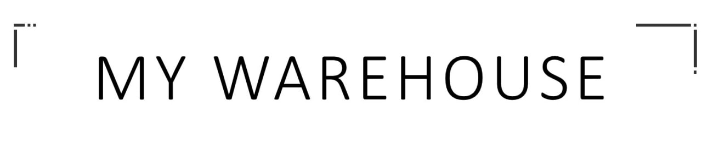

    

My Warehouse - приложение для консолидации информации по входящим поставкам на склад, 
с возможностью анализа загруженности в режиме онлайн  и планирования будущих поставок на склад.

[comment]: <> ([![Build Status]&#40;https://safeworks.ru/badge.svg&#41;]&#40;https://github.com/egorbarinov/commandProject/tree/Dev5&#41;)
[comment]: <> ([![Build Status]&#40;https://safeworks.ru/badge.svg&#41;]&#40;https://github.com/ZettroMan/warehouse/tree/dev&#41;)

OverView
------------
- Приложение состоит их двух модулей: 
  - Backend: Имеет монолитную архитектуру и реализован на следующем стеке технологий:
    - Core Java, 11th Ed;
    - SpringBoot Framework - мощный фреймворк для быстрого развертывания Web-приложений;
    - Spring Security - фреймворк, который сфокусирован на обеспечение как аутентификации, так и авторизации в Java-приложениях;
    - JWT - для безопасного взаимодействия backend и frontend посредством генерации токенов аутентификации;
    - Hibernate - для взаимодействия с базой данных;
    - JUnit5 - для покрытия тестами кода проекта;
    - MOCKITO - для покрытия тестами кода проекта;
    - SENTRY - мощный инструмент, который обеспечивает качественное ведение логгирования работы приложения, с сохранением результата в log-файл и отправкой его на электронную почту;
    - Swagger - это фреймворк и спецификация для определения REST APIs в формате, дружественном к пользователю и компьютеру (JSON или YAML);
    - FlyWay Migration - библиотека для быстрого развертывания или обновления базы данных на основе SQL- запросов; 
    - Apache POI - популярный API, который позволяет программистам создавать, изменять и отображать файлы MS Office с помощью программ Java ;
    - Data Base: - PostgreSQL - это свободно распространяемая объектно-реляционная система управления базами данных (СУБД), наиболее развитая из открытых СУБД в мире и являющаяся реальной альтернативой коммерческим базам данных.
  - Frontend: Angular - Открытая и свободная платформа для разработки веб-приложений, написанная на языке TypeScript, разрабатываемая командой из компании Google, а также сообществом разработчиков из различных компаний.

Installation
------------

- Для работы приложения требуется база данных PostgreSQL;
- Для быстрого развертывания базы данных можно воспользоватья FlyWay Migration;
- Дополнительно реализована возможность автоматической генерации таблиц посредством фреймворка Hibernate.

Community
---------

- Актуальная версия модуля приложения Backend доступна на [GitHub](https://github.com/egorbarinov/commandProject/tree/Dev5).
- Актуальная версия модуля приложения Frontend доступна на [GitHub](https://github.com/ZettroMan/warehouse/tree/dev).
